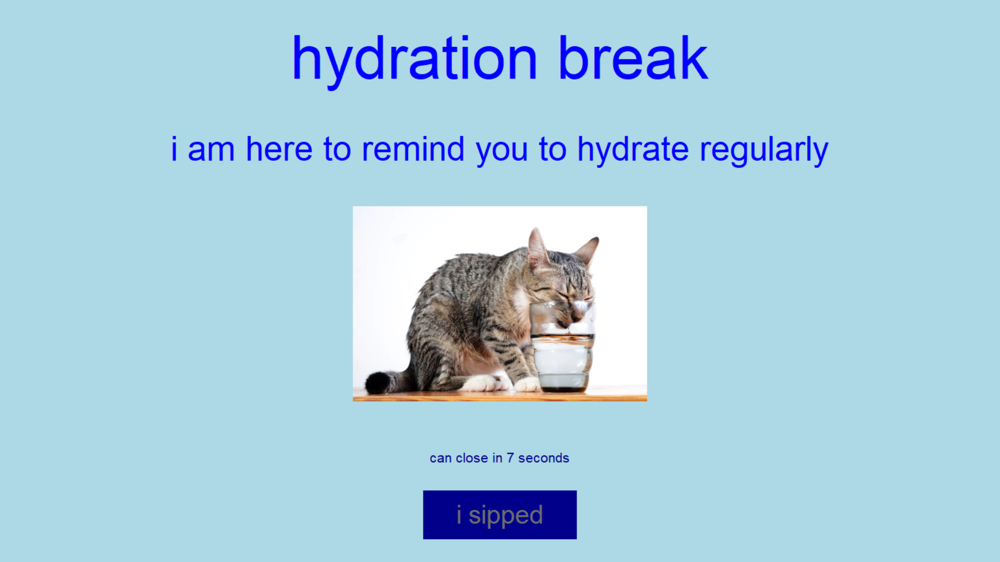

# Water reminder

Reminds you to drink water every 15, 30, or 60 minutes.

Can only be closed after 10 seconds, so you can't just close the popup every
time it pops up.

You can pause it for a few hours when you don't want to be interrupted.

## Instructions

1. Make sure you're running the correct python version (in .python-version)
2. Create venv: `python -m venv venv`
3. Activate venv: `./venv/Scripts/activate` on windows
4. Install dependencies: `python -m pip install -r requirements.txt`
5. Run the script: `python water_reminder.pyw`

You will find the little water droplet icon in your taskbar. Clicking on it
shows a menu with options to configure popup frequency, pausing the popups, and
quitting the program.

## Start on startup

Run the water reminder script when your computer starts up so you don't have to
start it manually every time.

On windows:

1. Create a shortcut: `water reminder.lnk` with path
   `C:\<path_to_your_installation>\water_reminder\venv\Scripts\pythonw.exe "C:\<path_to_your_installation>\water_reminder\water_reminder.pyw"`
2. Press win+R.
3. Type `shell:startup`
4. Move `water reminder.lnk` into the Startup folder that pops up
